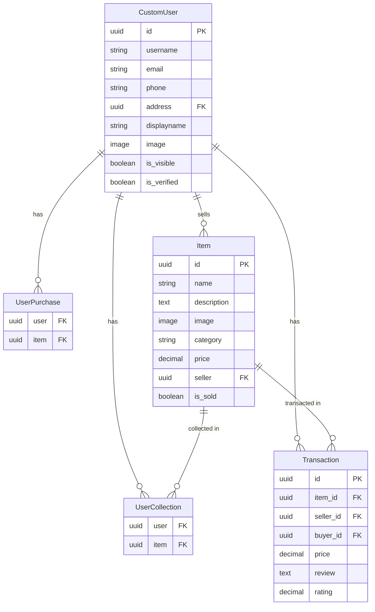

# Technical Documentation

## Introduction

### 1.1 Purpose

### 1.2 Scope

### 1.3 Audience

## System Overview

### 2.1 Architecture

#### Client-Server Architecture
- Sechand was built on Client-Server Architecture, the client side and server side was deployed separetly on Vercel and Heroku, communicating via HTTP reqiests.

#### APIs

#### The database
- Sechand uses three different databases. 

    - The main database is on Heroku, which is a PostgreSQL database storing all related data like items, user info, etc. 

    - A shadow database running on AWS, which is also a PostgreSQL database, the shadow database is used to validate the correctness of the current models and tables during software testing, without the risk to making dangerous changes on production database environment.

    - A object storage database running on AWS, storing image data for user's items and their avatars, etc.
### 2.2 Technologies Used

```
    - Node.js: 20.11.0
    - Django: 5.0.1
        - Python 3.12.1
    - Vue: 3.4.19
```

### 2.3 Dependencies

#### Sechand requires following dependencies to run locally:
```
    asgiref==3.7.2
    Django==5.0.1
    django-cors-headers==4.3.1
    djangorestframework==3.14.0
    djangorestframework-simplejwt==5.3.1
    pillow==10.2.0
    psycopg2-binary==2.9.9
    PyJWT==2.8.0
    pytz==2024.1
    sqlparse==0.4.4
    tzdata==2024.1
    gunicorn==21.2.0
    django-storages==1.14.2
    geopy==2.4.1
    channels==4.0.0
    channels_redis==4.2.0
    daphne==4.1.0
    uvicorn==0.28.0
    boto3==1.34.75
```
which is also present in `requirements.txt`

## Installation Guide

### 3.1 Prerequisites

#### Install Python and Node.js

- Before starting install any dependencies, make sure you installed Python and Node.js on your computer. 
    - Although it is recommended to install the same version we have, any higher version of Python should works.
    - Check the following website to install [Python](https://www.python.org/downloads/), and [Node.js](https://nodejs.org/en)
- You should also make sure that package managers like `pip` and `npm` are also installed.


### 3.2 System Requirements

Running SecHand locally requires following version of technologies:
```
    - Node.js: 20.11.0
    - Django: 5.0.1
        - Python 3.12.1
    - Vue: 3.4.19
```

### 3.3 Installation Steps

#### (1) Setup the virtual environment.

- ***If you don't want to install and enable virtual environment, Jump to Step 3.***
    
    ---

- If you have installed either Node/Python/Django on your computer with different versions and don't want to install another version of these due to your personal project dependencies, you can use a virtual environment to install the necessary packages that are required by SecHand.
    - To create a virtual environment, under the root folder of SecHand, use the following command:
        - For Windows
            ```cmd
            python -m venv <virtural env name>
            ```
        - For Mac
            ```cmd
            python3 -m venv <virtural env name>
            ```
            For example, use:
            ```cmd
            python -m venv venv_3_12_1
            or
            python3 -m venv venv_3_12_1
            ```
            to represent a virtural environment with python version 3.12.1
    - *We'll use folder name *venv_3_12_1* in the following README file*.

#### (2) Start the virtual environment

- After creating a virtual environment for this, you can use the following command to start it:
    - For Windows
        ```cmd
        .\venv_3_12_1\Scripts\activate
        ```
    - For Mac
        ```cmd
        source venv_3_12_1/bin/activate
        ```
- This will start the virtual env and create a virtual env mark, you may find it inside your terminal. 
- To exit from the virtual environment, use:
    ```cmd
    deactivate
    ```
    or if the above doesn't work and you are running on Mac, try:
    ```cmd
    source venv_3_12_1/bin/deactivate
    ```

#### (3) Install Django backend dependencies
- To install necessary dependencies, first you need to navigate to the root folder of the backend server, use:
    ```cmd
    cd sechand_backend
    ```
    
- In `sechand_backend`, where requirements.txt is located, run:
    ```cmd
    pip install -r requirements.txt
    ```
    
- If you see the `psycopg2` error when starting the backend, then try to manually install it again, try:
    ```cmd
    pip install psycopg2-binary==2.9.9
    ```
    *We've noticed that this error likely happens on MAC machine, but currently we have no clue what leads to this issue.*

#### (4) Run the Django backend
##### Database model migrations (Typically you won't need this, include here for completeness)

- If any models have been changed since the last migration, use the following command to migrate them to the database. 
- Under the backend directory (\sechand_backend) where manage.py is located. Run the following commands to migrate the database:

    ```cmd
    python manage.py makemigrations
    ```
    then
    ```cmd
    python manage.py migrate
    ```

#### Run the Django backend
- Under the same directory (\sechand_backend), run the following command to start the backend server:
    ```cmd
    python manage.py runserver
    ```
- Now If everything works correctly, you should see the server is up and running, prompting:
    ```
    Watching for file changes with StatReloader
    Performing system checks...

    System check identified no issues (0 silenced).
    <Server start time>
    <Django version>, using settings sechand_backend.settings
    Starting development server at http://127.0.0.1:8000/
    Quit the server with CTRL-BREAK.
    ```
- The server is now running on: http://localhost:8000

#### (5) Install Vue frontend dependencies
- After the backend is successfully up and running, the next step is to start the front end of SecHand.
- Go to the frontend directory (\sechand). Run the following command to install dependencies used by frontend:
    ```cmd
    npm install
    ```
- A `node_modules` folder will be created and all dependencies will be installed in there.
#### (6) Add .env file
- Create `.env` file in the frontend folder, and fill in the following content:
    ```
    VITE_HOST = "http://localhost:8000/"
    ```

#### (7) Run the Vue frontend

- Use the following command to start the frontend:
    ```cmd
    npm run dev
    ```

- Now If everything works correctly, you should see Django is up and running, prompting:
    ```
    ...
    Local:   http://localhost:5173/
    Network: use --host to expose
    press h + enter to show help
    ```

- The frontend should now be running on: http://localhost:5173/

## Configuration Guide

#### Add .env file to frontend root foler
- Create `.env` file in the frontend folder, and fill in the following content:
    ```
    VITE_HOST = "http://localhost:8000/"
    ```

### 4.1 Configuration Parameters

### 4.2 Environment Setup

### 4.3 External Services Integration

## Usage Guide

### 5.1 User Interface Overview

### 5.2 User Authentication

### 5.3 Core Functionality

### 5.4 Advanced Features

## API Documentation (if applicable)

### 6.1 Endpoints
#### Common API server prefix
`https://oose-project-65116e9428b0.herokuapp.com/`

#### Endpoints for item functionalities
- Get all items posted by user: `api/v1/post/UserItems/all` 
- Get all items across sechand: `Items/all`
- Get all items by distance: `Items/user/all`
- Add collections to user: `Items/Collection/new/<uuid:item_id>`
- Get user's collection: `Items/Collection`
- Delete User's collection: `Items/Collection/delete/<uuid:item_id>`
- Get item collection status related to current user: `Items/Collection/item/<uuid:item_id>`
- Post a new item: `Item/new`
- Get/update/dete a item: `Item/<uuid:item_id>`
- Search items: `Items/Search`
- Quick browsing items by category: `Items/Browse`
- Get all transactions of current user: `Order/Transactions/all`
- Add a new transaction: `Order/Transaction/new`
- Get a user's review and rating: `Order/Transaction/Review/<int:user_id>`
- Write a review to a user: `Order/Transaction/Review/add/<uuid:order_id>`
- Get current user's unreviewed order: `Order/Transaction/Review/UnReviewedOrder`

#### Endpoints for user functionalities
- New user registration: `register/`


### 6.2 Request and Response Formats

### 6.3 Authentication and Authorization

## Database Schema (if applicable)

### 7.1 Entity-Relationship Diagram

- User Models

---
- User Models


### 7.2 Table Definitions

### 7.3 Relationships and Constraints

## Testing

### 8.1 Test Plan

### 8.2 Test Results

### 8.3 Known Issues and Limitations

## Deployment

### 9.1 Deployment Process

#### The deployment of Sechand is handled automatically via Github CI/CD pipeline. 
- Any code changes, push, pull reguest to branches like `main`, `pre-deploy` will trigger the deployment process after successfully finishing and passing all the requirement tests.

- Sechand will be devided into two parts, and being deployed separately.

- The frontend will be deployed on Vercel, which is the main user interface, responsible for sending request to backend, and display datas and updates.

- The backend will be deplyed on Heroku, which is the server of Sechand, manipulating all the data, request, registration, etc.

#### The database Sechand used will be running on AWS and Heroku. 
- Sechand uses three different databases. 

- The main database is on Heroku, which is a PostgreSQL database storing all related data like items, user info, etc. 

- A shadow database running on AWS, which is also a PostgreSQL database, the shadow database is used to validate the correctness of the current models and tables during software testing, without the risk to making dangerous changes on production database environment.

- A object storage database running on AWS, storing image data for user's items and their avatars, etc.

## Glossary

### 10.1 Terms and Definitions
